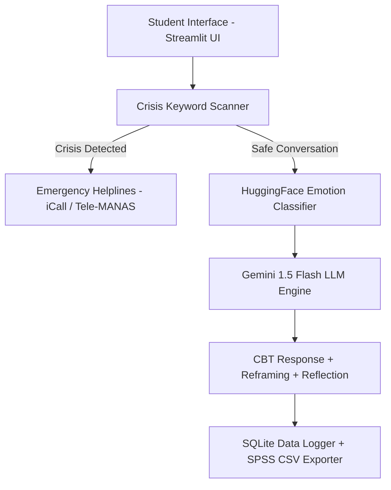

# 🧠 MindSaathi (माइंड साथी) — AI Mental Health Chatbot

> **Design, Build, and Evaluation of a Culturally-Adapted AI Mental Health Support System for Indian College Students**  
> *Project + Research Paper Implementation (Compliant with SRD v1.0 & PRD v1.0 specifications)*

---

## 🌟 Project Overview

**MindSaathi** is a culturally-adapted, AI-powered mental health chatbot designed specifically for Indian college students (aged 18–28). Built with a 5-layer architecture combining **Google Gemini 1.5 Flash**, **HuggingFace DistilRoBERTa Emotion Detection**, and **SQLite Session Logging**, MindSaathi addresses the severe shortage of mental health professionals in India by providing instant, stigma-free, and empathetic support in English and Hinglish.

---

## 🏗️ 5-Layer System Architecture



1. **L1 — Frontend:** Streamlit mobile-responsive web UI featuring session management, PSS-4 pre/post check-in flow, and interactive coping tools.
2. **L2 — Emotion Engine:** HuggingFace `j-hartmann/emotion-english-distilroberta-base` classifying messages into 7 emotion categories (joy, sadness, anger, fear, surprise, disgust, neutral) with confidence threshold overrides (< 0.45 default to neutral).
3. **L3 — AI Brain:** Google Gemini API configured with a tailored system prompt incorporating Indian cultural stressors (JEE/NEET/UPSC stress, family expectations/izzat, hostel loneliness, career displacement).
4. **L4 — Safety & Crisis Guard:** Bilingual (English + Hindi/Hinglish) keyword scanner providing immediate helpline referral (`iCall`: 9152987821, `Vandrevala`: 1860-2662-345, `NIMHANS`: 080-46110007, `Tele-MANAS`: 14416) with 0% false negative target.
5. **L5 — Data & Analytics Logger:** Anonymous SQLite database logging pre/post Perceived Stress Scale (PSS-4) scores, TAM ratings, and statistical exports for SPSS/JASP analysis.

---

## 🚀 Quick Start & Installation

### 1. Prerequisites
- Python 3.10+ installed
- A free Google Gemini API Key from [Google AI Studio](https://aistudio.google.com/)

### 2. Clone / Setup Workspace
```bash
git clone https://github.com/your-username/mindsathi.git
cd mindsathi
```

### 3. Create Virtual Environment & Install Dependencies
```bash
python -m venv venv
# On Windows PowerShell:
.\venv\Scripts\Activate.ps1
# On macOS/Linux:
source venv/bin/activate

pip install -r requirements.txt
```

### 4. Configure API Key
Create a `.env` file in the project root:
```env
GEMINI_API_KEY=your_actual_gemini_api_key_here
```

### 5. Launch Application
```bash
streamlit run app.py
```

---

## 🔬 Research Analysis & Paper Tools

MindSaathi includes automated scripts to calculate research metrics and produce 300 DPI publication-ready figures for PLOS ONE / IEEE Access / Frontiers in AI submission:

1. **Pre-Post Stress Reduction Analysis (Paired t-test & Cohen's d):**
   ```bash
   python analysis/stress_analysis.py
   ```
2. **Emotion Classifier Accuracy (vs Self-Reported Labels):**
   ```bash
   python analysis/emotion_accuracy.py
   ```
3. **Generate Publication Figures (300 DPI PNGs):**
   ```bash
   python analysis/charts.py
   ```
4. **Run Pytest Unit & Safety Tests:**
   ```bash
   pytest tests/
   ```

---

## 📁 Repository Directory Structure

```
mindsathi/
├── app.py                    # Main Streamlit application entry point
├── requirements.txt          # Production dependencies
├── .env.example              # Environment key template
├── .gitignore                # Git exclusions
├── README.md                 # Project documentation
│
├── modules/                  # Core System Modules
│   ├── crisis_handler.py     # Bilingual crisis keyword detection
│   ├── emotion_detector.py   # HuggingFace emotion classification
│   ├── gemini_client.py      # Gemini API integration & fallback logic
│   ├── session_logger.py     # SQLite logging & SPSS CSV exporter
│   └── survey.py             # PSS-4 & post-session TAM survey instruments
│
├── prompts/                  # Prompt Engineering Artifacts
│   └── system_prompt.txt     # MindSaathi Gemini System Prompt
│
├── analysis/                 # Statistical & ML Evaluation Tools
│   ├── stress_analysis.py    # Paired t-test & Cohen's d computation
│   ├── emotion_accuracy.py   # Accuracy, Precision, Recall, F1 metrics
│   └── charts.py             # Matplotlib 300 DPI figure generator
│
├── data/                     # Database & Research Exports
│   ├── sessions.db           # Auto-created SQLite DB
│   └── export/               # CSV & PNG figure exports
│
└── tests/                    # Unit & Safety Tests
    ├── test_crisis.py        # Crisis detection unit tests
    └── test_emotion.py       # Emotion module unit tests
```

---

## 📞 24/7 Crisis Helplines (India)
- **iCall (TISS):** 9152987821 (Mon–Sat, 8 AM–10 PM)
- **Vandrevala Foundation:** 1860-2662-345 / 9999-666-555 (24x7)
- **NIMHANS Toll-Free:** 080-46110007 (24x7)
- **Tele-MANAS:** 14416 / 1800-891-4416 (24x7)

---
*Developed with ❤️ for Indian Student Mental Health & Academic Research.*
